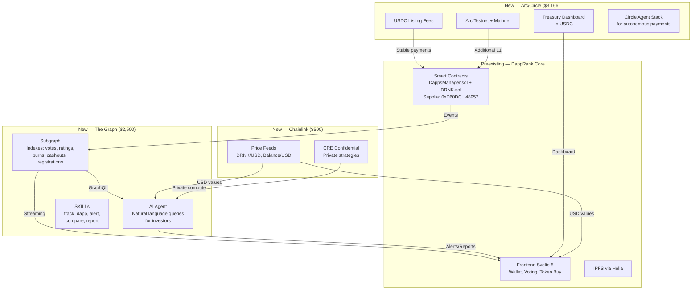

# DappRank — ETHOnline 2026 Continuity Track Strategy

> **Generated:** September 6, 2026
> **Purpose:** Standalone reference for any AI or human to understand the full context of DappRank, the ETHOnline 2026 hackathon, and the optimal prize strategy for the Continuity Track — without needing to re-read source files or re-fetch hackathon pages.

---

## Table of Contents

1. [Project Overview: DappRank](#1-project-overview-dapprank)
2. [Hackathon Context: ETHOnline 2026](#2-hackathon-context-ethonline-2026)
3. [Continuity Track Rules](#3-continuity-track-rules)
4. [Complete Sponsor Prize Analysis](#4-complete-sponsor-prize-analysis)
5. [Technical Complexity Assessment](#5-technical-complexity-assessment-based-on-documentation-research)
6. [Optimal Prize Strategy](#6-optimal-prize-strategy)
7. [Implementation Plan (Refined)](#7-implementation-plan-refined)
8. [Submission Requirements](#8-submission-requirements)
9. [Appendix: Source Code Map](#9-appendix-source-code-map)

---

## 1. Project Overview: DappRank

### What is DappRank?

DappRank is a **decentralized ranking system for dApps** using a novel voting mechanism called **Square Root Weighted Voting (SRWV)**. It combines:

- A **deflationary token model** (ultrasound money concept)
- A **fair governance system** resistant to whale manipulation
- **IPFS integration** for decentralized content storage

### Core Innovation: Square Root Weighted Voting (SRWV)

The SRWV system calculates voting power as the **square root of staked tokens**:

```
W_i = sqrt(T_i)
```

Where:

- `W_i`: Fan weight (voting power) of voter `i`
- `T_i`: Tokens staked by voter `i`

The final dApp rating is:

```
D_r = (sum(V_i * sqrt(T_i))) / (sum(sqrt(T_i)))
```

This ensures voting power grows **sublinearly** with token holdings, preventing whale domination:

- 100 tokens → 10 votes
- 10,000 tokens → 100 votes (not 10,000)
- 1,000,000 tokens → 1,000 votes (not 1,000,000)

### Deployed Contracts (Sepolia)

| Contract         | Address                                      | Description                                       |
| ---------------- | -------------------------------------------- | ------------------------------------------------- |
| **DappsManager** | `0x6b0EB389DD4B3ad4E9a28f56f971735aD2A85baD` | Main contract: voting, dapp registration, rewards |
| **DRNK Token**   | `0x9549A8CcaB9fF25Cf5061bFBC5188Baed0615B60` | ERC20 with burn, permit, votes capabilities       |

### Tech Stack

| Layer               | Technology                                     | Details                                               |
| ------------------- | ---------------------------------------------- | ----------------------------------------------------- |
| **Smart Contracts** | Solidity ^0.8.30 + Foundry                     | `DappsManager.sol`, `DRNK.sol`, `Conversor.sol`       |
| **Frontend**        | Svelte 5 + Vite                                | Wallet connection, voting UI, token buying, dApp list |
| **Blockchain**      | Ethereum Sepolia                               | Testnet deployment                                    |
| **Storage**         | IPFS via Helia                                 | Decentralized file storage for dApp content           |
| **Web3 Library**    | ethers.js v6                                   | Contract interactions                                 |
| **Dependencies**    | OpenZeppelin (AccessControl, ERC20), Forge Std | Smart contract libraries                              |

### Smart Contract Architecture

#### `DappsManager.sol` — Main Contract

**Roles:**

- `DEFAULT_ADMIN_ROLE`: Full admin control
- `DAO_ROLE`: DAO governance operations

**Core Data Structures:**

```solidity
struct Dapp {
    string cid;           // IPFS content identifier
    uint256 rate;         // Final rating (Dr)
    uint256 weight_votes_sum;   // Sum(Vi x sqrt(Ti))
    uint256 weight_total_sum;   // Sum(sqrt(Ti))
    uint256 balance;      // Accumulated token balance
    uint256 burned;       // Total tokens burned
    address owner;        // Dapp owner address
    Status status;        // Submitted, Active, Expired, Banned
    mapping(address => Vote) votes;
}

struct Vote {
    uint256 vote_rate;    // Vi (0-100)
    uint256 fan_weight;   // Wi = sqrt(Ti)
    uint256 timestamp;
}

struct Fan {
    uint256 multiplier;
    uint256 expires;
}
```

**Key Functions:**

- `registerDapp(bytes32 name, string memory cid)` — Register a dApp (payable listing fee)
- `voteDapp(bytes32 name, uint256 amount, uint256 rate)` — Vote on a dApp (SRWV applied)
- `approveDapp(bytes32 name)` / `banDapp(bytes32 name)` — Admin moderation
- `dappCashOut(bytes32 name, uint256 amount)` — Owner withdraws rewards
- `buyDRNK()` — Purchase DRNK tokens with ETH
- `burn(uint256 amount)` — Burn DRNK tokens
- `getDappInfo(bytes32 name)` — Get dApp details
- `getAllDappNames()` / `getAllFans()` — List all dApps/fans

**Fee Structure:**

- `listingFee`: Fixed price to register a dApp
- `DAOFee`: % (in basis points) taken on cashouts for DAO treasury
- `burnFee`: % (in basis points) burned on each vote (ultrasound money)

#### `DRNK.sol` — Token Contract

- ERC20 + ERC20Burnable + ERC20Permit + ERC20Votes + AccessControl
- `MINTER_ROLE` for minting (granted to DappsManager)
- Used for governance voting power

#### `Conversor.sol` — Utility Library

- `stringToBytes32(string)` / `bytes32ToString(bytes32)` — Type conversion helpers

### Frontend Components (Svelte 5)

| Component         | File                                    | Purpose                         |
| ----------------- | --------------------------------------- | ------------------------------- |
| `WalletConnector` | `src/components/WalletConnector.svelte` | MetaMask connection             |
| `DappRankList`    | `src/components/DappRankList.svelte`    | Display ranked dApps            |
| `DappsData`       | `src/components/DappsData.svelte`       | Refresh dApp data from contract |
| `Vote4Dapp`       | `src/components/Vote4Dapp.svelte`       | Voting UI popup                 |
| `GetDRNK`         | `src/components/GetDRNK.svelte`         | Buy DRNK tokens popup           |
| `IPFSConnector`   | `src/components/IPFSConnector.svelte`   | Upload files to IPFS            |

### State Management (`src/lib/ethers.svelte.js`)

Uses Svelte 5 `$state` runes for reactive state:

- `ethVars`: provider, signer, signerAddress, contract, tokenContract, dappsList

---

## 2. Hackathon Context: ETHOnline 2026

### Event Details

| Item                    | Info                                               |
| ----------------------- | -------------------------------------------------- |
| **Event**               | ETHOnline 2026                                     |
| **Organizer**           | ETHGlobal                                          |
| **Submission Deadline** | Sunday, September 13, 2026 at 12:00 pm EDT         |
| **Staking**             | Participants stake ETH (returned after submission) |
| **Team Size**           | Up to 5 people                                     |
| **Demo Video**          | 2-4 minutes (mandatory, 720p minimum)              |
| **Judging**             | Async (partner prizes) + Live (finalist)           |
| **Max Partner Prizes**  | 3 selections (multi-track partners count as 1)     |

### Judging Criteria

| Criterion                | Weight                                                         |
| ------------------------ | -------------------------------------------------------------- |
| **Technicality**         | How complex is the problem? How sophisticated is the solution? |
| **Originality**          | New idea or creative solution to an existing problem?          |
| **Practicality**         | How complete and functional? Could it be used today?           |
| **Usability (UI/UX/DX)** | How intuitive is the project?                                  |
| **WOW Factor**           | Lasting impression, unique elements                            |

### Key Rules

- **Continuity Track**: Can build on existing open-source codebase
- **Must document** pre-existing work vs. new work (git history)
- **AI tools permitted** but must document usage
- **Version control required** — no single large commits

---

## 3. Continuity Track Rules

### What is the Continuity Track?

The Continuity Track allows participants to **extend an existing open-source project** or **ship a new feature on an existing product**, rather than starting from scratch.

### Requirements

1. **Pre-existing code is allowed** — the project can have code written before the hackathon
2. **New work must be clearly documented** — README must separate what existed before from what is new
3. **Git history matters** — commit history should show work done during the event
4. **Only work done during the event is judged** — polish and bug fixes alone won't qualify
5. **Demo video required** — 2-4 minutes focusing on the new work

### Eligibility for Partner Prizes

- Continuity Track participants are eligible for **specific Continuity-designated prizes**
- Some partners have separate "From Scratch" and "Continuity" pools
- Must select the correct pool when submitting

### Documentation Requirements

```
## Pre-existing Code (before hackathon)
- [List what existed before]

## New Work (during hackathon)
- [List what was built during the event]
```

---

## 4. Complete Sponsor Prize Analysis

### Overview: All Sponsors

| Sponsor      | Total Pool | # of Tracks                                  | Continuity Track?                  |
| ------------ | ---------- | -------------------------------------------- | ---------------------------------- |
| The Graph    | $15,000    | 2 (Composable + AI)                          | ✅ AI Use Case (Continuity)        |
| Hedera       | $15,000    | 3 (AI Payments + Open Source + Tokenization) | ✅ Continuity ($1,000)             |
| Arc (Circle) | $10,000    | 4 (DeFi + Agentic + Continuity + Launch)     | ✅ Best DeFi/Agentic + Launch      |
| World        | $7,000     | 2 (AgentKit + Selfie Check)                  | ✅ AgentKit Continuity             |
| 1inch        | $7,000     | 2 (Aqua App + Continuity)                    | ✅ Aqua App (Continuity)           |
| ENS          | $5,000     | 2 (ENSv2 + Integration)                      | ✅ Integration into Existing       |
| Uniswap      | $5,000     | 2 (Stack + Continuity)                       | ✅ Stack Contribution (Continuity) |
| Ledger       | $5,000     | 2 (AI Agents + Continuity)                   | ✅ Continuity                      |
| Privy        | $5,000     | 2 (B2B + Financial Flow)                     | ❌ No Continuity track             |
| Chainlink    | $3,000     | 2 (Confidential + Upgrade)                   | ✅ Best Upgrade (Continuity)       |
| Bazantic     | $3,000     | 3 (Help Agent + Recipe + Agentify)           | ✅ Help an Agent (Continuity)      |

### Detailed Prize Breakdown (Continuity Tracks Only)

#### 🥇 The Graph — Best AI Tooling/AI Use Case (Continuity)

- **Prize Pool:** $5,000
- **1st Place:** $2,500 | **2nd:** $1,500 | **3rd:** $1,000
- **Requirements:**
  - Use The Graph as load-bearing part of project
  - Consume live data from a Graph provider (Subgraph Studio or The Graph Market)
  - Do meaningful work with data (reasoning, decisions, automation, natural-language interface)
  - Open-source code with README or SKILL.md
  - Demo video 2-4 minutes
- **Resources:** Subgraph MCP, Subgraph SKILLs, Substreams SKILLs
- **Fit for DappRank:** ✅ EXCELLENT — Subgraph indexes dApp data, AI Agent provides investor insights

#### 🥇 Arc (Circle) — Best DeFi or Agentic Application (Continuity)

- **Prize:** $1,666 (1st place)
- **Requirements:**
  - Meaningful use of Arc and USDC
  - Advanced programmable money flows
  - Functional MVP + architecture diagram
  - Registered as Continuity Project
- **Fit for DappRank:** ✅ HIGH — USDC listing fees, treasury dashboard

#### 🥇 Arc (Circle) — Launch on Arc Testnet & Push to Mainnet (Continuity)

- **Prize:** $1,500 (1st place)
- **Requirements:**
  - Add working Arc integration to existing project
  - Deployed or deployment-ready on Arc mainnet by September 30
  - Functional MVP + architecture diagram
- **Fit for DappRank:** ✅ HIGH — Deploy DappRank on Arc as additional settlement layer

> **Note:** Arc has 2 Continuity tracks. Since they are the same sponsor, they count as **1 selection** in the submission form, but you can win both.

#### 🥇 World — AgentKit Continuity

- **Prize Pool:** $3,500 (up to 3 teams receive $1,166 each)
- **Requirements:**
  - Uses AgentKit meaningfully
  - Shows working app
  - Registers/resolves agents through AgentBook
  - Uses World ID Sandbox App
  - Includes feedback document on docs, portal, sandbox
- **Fit for DappRank:** ✅ MEDIUM — Could verify human investors vs. bots, but not core to tracking

#### 🥇 1inch — Build an Aqua App (Continuity)

- **Prize:** $1,500 (1st) | $500 (2nd)
- **Requirements:**
  - Official Aqua/SwapVM contracts used
  - On-chain execution of token transfers
  - Proper git commit history
- **Fit for DappRank:** ❌ LOW — Aqua is about self-custodial liquidity pools, unrelated to dApp ranking

#### 🥇 ENS — Best Integration of ENSv2 into an Existing Project (Continuity)

- **Prize:** $500 (1st)
- **Requirements:**
  - Integration uses ENSv2 on Sepolia
  - Targets existing project's testnet deployment
  - Clear how ENSv2 improves the project
- **Fit for DappRank:** ✅ MEDIUM — Replace bytes32 dApp names with ENS names, but limited scope

#### 🥇 Uniswap — Best Uniswap Stack Contribution (Continuity)

- **Prize:** $1,000 (1st) | $1,000 (2nd)
- **Requirements:**
  - Build on/integrate Uniswap stack (API, AMM v2/v3/v4, CCA)
  - Public GitHub repo + FEEDBACK.md + Uniswap feedback form
- **Fit for DappRank:** ✅ MEDIUM — Could add DRNK liquidity pool on Uniswap, but tangential

#### 🥇 Ledger — Continuity

- **Prize:** $1,000 (1st) | $500 (2nd)
- **Requirements:**
  - Extend existing project with Ledger Agent Stack
  - Add hardware signer, Key Ring, or device confirmation
- **Fit for DappRank:** ✅ MEDIUM — Hardware security for DAO admin actions, but not investor-facing

#### 🥇 Chainlink — Best Chainlink-Powered Upgrade (Continuity)

- **Prize:** $500 (1st)
- **Requirements:**
  - Integrate Chainlink service directly in smart contract logic or on-chain workflows
  - Must contribute to a state change on blockchain (not just display data)
  - Demonstrate how upgrade improves the project
  - Use CRE instead of deprecated Functions/Automation
- **Fit for DappRank:** ✅ HIGH — Price Feeds for USD valuation, CRE for confidential investor strategies

#### 🥇 Bazantic — Help an Agent Use Your Hackathon Project (Continuity)

- **Prize:** Up to 2 teams receive $500 each
- **Requirements:**
  - Create x402/MPP Gateway in Bazantic
  - Create a Recipe explaining when/why/how to use the service
  - Show improvement with Recipe vs. without
  - Demo video
- **Fit for DappRank:** ✅ MEDIUM — Agent API gateway for DappRank data, but $500 max

#### 🥇 Hedera — Continuity

- **Prize:** $1,000 (1st)
- **Requirements:**
  - Project must have been built for previous hackathon or exist on Hedera
  - Demonstrate substantive new work
- **Fit for DappRank:** ❌ LOW — DappRank is on Ethereum/Sepolia, not Hedera. Porting would be major effort.

---

## 5. Technical Complexity Assessment (Based on Documentation Research)

> **Research Date:** September 6, 2026
> **Methodology:** Each partner's official documentation, SDK references, GitHub repos, and quickstart guides were consulted to assess real implementation complexity, dependencies, risks, and fit for DappRank.

---

### 5.1 The Graph — Complexity: MEDIUM-HIGH

#### Documentation Sources Consulted

- [Subgraph MCP Introduction](https://thegraph.com/docs/en/subgraphs/tooling/subgraph-mcp/introduction/) — MCP server for natural-language Subgraph queries
- [Subgraphs SKILLs (GitHub)](https://github.com/graphprotocol/subgraphs-skills) — Claude Code plugin for subgraph development
- [Substreams SKILLs (GitHub)](https://github.com/streamingfast/substreams-skills) — Agent skills for Substreams (Ethereum, SQL, sinks, testing, deployment)

#### What It Does

- **Subgraph MCP**: An MCP-compatible server that translates natural language prompts into Subgraph queries. Integrates with Claude, Cline, Cursor. Can search subgraphs, inspect GraphQL schemas, run queries, retrieve 30-day query volumes.
- **Subgraphs SKILLs**: Claude Code plugin with 3 skills: `subgraph-dev` (schema design, manifest config, AssemblyScript mappings, composition), `subgraph-optimization` (performance, pruning, indexing), `subgraph-testing` (Matchstick, linter, CI/CD).
- **Substreams SKILLs**: 9 skills covering: dev, Ethereum, Solana, SQL, sink, sink-deploy-local, hosted-sink, The Graph Market API, testing.

#### Implementation Steps

1. Create `subgraph.yaml` manifest with DappsManager contract address on Sepolia
2. Define `schema.graphql` with entities: Dapp, Vote, GlobalStat
3. Write AssemblyScript mappings for events: `DappRegistered`, `DappApproved`, `DappBanned`, `VoteCast` (may need to add event emission to contract)
4. Deploy to Subgraph Studio (free, live data required)
5. Install Subgraph MCP server and configure with deployed subgraph
6. Build AI agent using MCP tools for natural-language queries
7. Optionally create SKILLs for reusable DappRank analysis

#### Dependencies

- `graph-cli` (npm) for subgraph deployment
- `@graphprotocol/graph-ts` for AssemblyScript mappings
- Subgraph MCP server (open source)
- Claude Code or compatible MCP client for AI agent

#### Risks & Considerations

- **Event emission**: `DappsManager.sol` does NOT currently emit events for votes. May need to add `event VoteCast(...)` to the contract and redeploy. This is a significant consideration.
- **Live data requirement**: Subgraph must consume live data from a Graph provider. Mocked/static data disqualifies.
- **Composition requirement**: The "Best Use of Composable Products" track ($5,000) requires composing 2+ Graph products OR building on standardized schema. The "AI Use Case" Continuity track ($2,500) does NOT require composition — just using The Graph as load-bearing data source.
- **SKILLs already exist**: Subgraphs SKILLs and Substreams SKILLs are pre-built. We can use them directly rather than building from scratch.

#### Estimated Time

- Subgraph creation + deploy: 1-2 days
- AI Agent + MCP integration: 1-2 days
- SKILLs creation (optional): 1 day

---

### 5.2 Arc / Circle — Complexity: MEDIUM

#### Documentation Sources Consulted

- [Arc Docs (llms.txt)](https://docs.arc.io/llms.txt) — Full documentation index
- [Arc App Kit](https://docs.arc.io/app-kit) — SDK for Bridge, Swap, Send, Unified Balance
- [Circle Agent Stack Starter Kits (GitHub)](https://github.com/circlefin/agent-stack-starter-kits) — 6 framework kits (LangChain, Claude Agent SDK, Mastra, OpenAI Agents, Vercel AI, Google ADK)
- [Arc EVM Differences](https://docs.arc.io/arc/references/evm-differences.md) — Key differences from standard EVM

#### What It Does

- **Arc Network**: Purpose-built L1 from Circle. EVM-compatible (Osaka baseline) with key differences:
  - **USDC is the native gas token** (not ETH). 18 decimals natively.
  - **Sub-second deterministic finality** — no need to wait for confirmations.
  - **Stable fee design** — predictable gas fees in USD terms.
  - **Opt-in privacy** — confidential transactions with selective disclosure.
- **App Kit**: `@circle-fin/app-kit` npm package. Single SDK for Bridge (cross-chain USDC via CCTP), Swap (same-chain), Send (wallet-to-wallet), Unified Balance (chain-abstracted USDC balance).
- **Agent Stack Starter Kits**: 6 framework-specific kits that wire Circle Agent Stack (wallets, nanopayments, marketplace) into popular AI frameworks. Uses `circle` CLI + skills installed from disk.

#### Implementation Steps

**For "Best DeFi/Agentic Application" ($1,666):**

1. Deploy DappsManager.sol on Arc Testnet (EVM-compatible, minor adjustments for USDC gas)
2. Modify listing fees to accept USDC (or keep ETH-equivalent using Arc's native USDC)
3. Integrate Circle App Kit for USDC payment flows
4. Build Treasury Dashboard showing USDC balances
5. Optionally integrate Agent Stack for autonomous agent payments

**For "Launch on Arc Testnet & Push to Mainnet" ($1,500):**

1. Deploy contracts on Arc Testnet
2. Verify contracts on Arcscan (block explorer)
3. Document mainnet deployment readiness
4. Must be deployment-ready on Arc mainnet by September 30

#### Dependencies

- `@circle-fin/app-kit` (npm)
- `@circle-fin/adapter-viem-v2` or `ethers` adapter
- `@circle-fin/cli` (Circle CLI) for Agent Stack
- Arc Testnet RPC endpoint
- Circle account for faucet tokens

#### Risks & Considerations

- **EVM differences**: USDC is gas token (not ETH). Contracts that use `msg.value` or transfer ETH need modification. `DappsManager.sol` uses `msg.value` for `buyDRNK()` and `registerDapp()` — these would need to accept USDC instead.
- **Mainnet deadline**: Arc mainnet launch is required by Sept 30 for the Launch prize. If mainnet isn't available by then, this prize may not be winnable.
- **Arc is testnet-only currently** — no mainnet available yet. Check status before committing.
- **Agent Stack requires learning**: The starter kits are well-documented but require understanding Circle CLI, skills system, and approval gates.
- **High prize value**: Combined $3,166 makes this the highest-value target.

#### Estimated Time

- Contract deployment on Arc Testnet: 0.5 day
- USDC integration + fee modification: 1 day
- Treasury Dashboard: 1 day
- Agent Stack integration (optional): 1-2 days

---

### 5.3 Chainlink — Complexity: LOW (Price Feeds) / HIGH (CRE)

#### Documentation Sources Consulted

- [CRE Docs](https://docs.chain.link/cre) — Chainlink Runtime Environment overview
- [Hello Confidential Workflows](https://docs.chain.link/cre-templates/hello-confidential-workflows) — Confidential workflow quickstart template
- [CRE Templates (GitHub)](https://github.com/smartcontractkit/cre-templates) — AI Audit Firewall, Automated Liquidation Protection, Portfolio Rebalancing
- [Chainlink Data Feeds](https://docs.chain.link/data-feeds) — Price Feeds documentation

#### What It Does

- **Price Feeds**: Decentralized oracle network providing asset prices on-chain. Simple integration via `AggregatorV3Interface`. Proxy contract pattern with upgradability. Heartbeat + deviation threshold updates. Available on most EVM chains including Sepolia.
- **CRE (Chainlink Runtime Environment)**: All-in-one orchestration layer for institutional-grade smart contracts. Build workflows in Go or TypeScript, compile to WASM, deploy to Decentralized Oracle Network (DON).
- **Confidential Workflows (Private Beta)**: Execute sensitive logic inside TEE (AWS Nitro). Secrets fetched inside enclave via Vault DON. Requires enrollment through Chainlink account team.

#### Implementation Steps

**For Price Feeds ($500 — Best Chainlink-Powered Upgrade):**

1. Identify relevant Price Feed proxy addresses on Sepolia (ETH/USD, etc.)
2. Create a consumer contract or frontend integration using `AggregatorV3Interface`
3. Display USD values for: DRNK token price, dApp balances, burned tokens, listing fees
4. Must contribute to a **state change on blockchain** (not just display data in frontend)

**For CRE Confidential Workflows (optional):**

1. Install CRE CLI (`curl -sSL https://app.chain.link/cre/install.sh | bash`)
2. Create CRE account at app.chain.link/cre/discover
3. Build workflow using `cre init --template=hello-confidential-workflows-ts`
4. Requires private beta enrollment for confidential features

#### Dependencies

- `@chainlink/contracts` (npm) for Price Feed interfaces
- `cre` CLI for CRE workflows
- Go or Node.js/bun for workflow development

#### Risks & Considerations

- **Price Feeds are simple but must cause state change**: The Chainlink Continuity prize requires the integration to contribute to a **state change on a blockchain**. Simply displaying data in a frontend is NOT sufficient. Need to write a smart contract that uses Price Feed data to modify state (e.g., dynamic fee calculation based on USD value).
- **CRE Confidential Workflows is private beta**: Requires enrollment through Chainlink account team. May not be accessible during hackathon.
- **Low effort, decent prize**: $500 for a few hours of work is good value.
- **Sepolia has Price Feeds**: ETH/USD feed available on Sepolia for testing.

#### Estimated Time

- Price Feed smart contract integration: 0.5 day
- Frontend USD display: 0.5 day
- CRE workflow (if accessible): 1-2 days

---

### 5.4 World (AgentKit) — Complexity: MEDIUM

#### Documentation Sources Consulted

- [AgentKit Integration Guide](https://docs.world.org/agents/agent-kit/integrate) — Quickstart with Hono, x402, AgentBook

#### What It Does

- **AgentKit**: x402 extension that distinguishes human-backed agents from bots/scripts. npm package `@worldcoin/agentkit`.
- **Flow**: Register agent wallet in AgentBook → Wrap x402 calls with `agentkit.fetch` → Wire hooks-based server with free-trial mode → Verify human backing.
- **Supports**: World Chain + Base for payments. AgentBook lookup always on World Chain.

#### Fit for DappRank

- Could verify that investors using the AI agent are real humans
- Adds friction to the investor experience (requires World App verification)
- Not core to the "continuous tracking" value proposition
- Prize is $1,166 (shared among up to 3 teams)

#### Estimated Time: 1-2 days

---

### 5.5 ENS (ENSv2) — Complexity: LOW-MEDIUM

#### Documentation Sources Consulted

- [ENSv2 Overview](https://docs.ens.domains/ensv2/overview) — Hierarchical registries, Enhanced Access Control, Permissioned Resolvers

#### What It Does

- **ENSv2**: Upgraded ENS with hierarchical registries, role-based permissions (replacing Name Wrapper fuses), per-account Permissioned Resolvers, record aliasing.
- **Deployed on Sepolia** — same testnet as DappRank.

#### Fit for DappRank

- Replace `bytes32` dApp names with human-readable ENS names
- Use Permissioned Registry for subname management
- Nice UX improvement but limited scope
- Prize is only $500

#### Estimated Time: 1 day

---

### 5.6 Uniswap — Complexity: MEDIUM

#### Documentation Sources Consulted

- [Uniswap Docs](https://developers.uniswap.org/docs) — API, v4 hooks, SDKs, Uniswap AI

#### What It Does

- Uniswap API for swaps, v4 hooks for custom pool logic, SDKs for integration
- Uniswap AI skills for agent-based development

#### Fit for DappRank

- Could create a DRNK liquidity pool on Uniswap
- Could use Uniswap API to swap DRNK for other tokens
- Tangential to ranking/tracking — would feel forced
- Prize is $1,000 (1st place)

#### Estimated Time: 1-2 days

---

### 5.7 Ledger — Complexity: MEDIUM-HIGH

#### Documentation Sources Consulted

- [Ledger × ETHOnline 2026](https://developers.ledger.com/ethonline) — Track details, DMK skills, Wallet CLI, Key Ring

#### What It Does

- **DMK Skills**: Teach agents to wire Ledger signer into apps
- **Wallet CLI**: Drive Ledger apps from terminal
- **Key Ring CLI**: Encrypt secrets under Ledger seed keys

#### Fit for DappRank

- Add Ledger hardware signer for DAO admin operations
- Use Key Ring for secure key management
- Not investor-facing — more about operational security
- Prize is $1,000 (1st place)

#### Estimated Time: 2-3 days

---

### 5.8 Bazantic — Complexity: LOW-MEDIUM

#### Documentation Sources Consulted

- [Bazantic](https://bazantic.com) — x402/MPP Gateway, MCP Server, Recipes

#### What It Does

- Create x402/MPP Gateway for APIs
- Deploy MCP Server
- Create Recipes explaining when/why/how to use services

#### Fit for DappRank

- Expose DappRank data as agent-consumable API
- Create Recipes for investor analysis
- Prize is $500 (up to 2 teams)

#### Estimated Time: 1 day

---

### 5.9 Complexity Summary Matrix

| Partner          | Complexity  | Effort (Days) | Risk Level | Prize (1st) | $/Day Ratio | Fit Score (1-10) |
| ---------------- | ----------- | ------------- | ---------- | ----------- | ----------- | ---------------- |
| **Arc (Circle)** | MEDIUM      | 3-4           | Medium     | $3,166      | ~$791/day   | 9                |
| **The Graph**    | MEDIUM-HIGH | 3-4           | Medium     | $2,500      | ~$625/day   | 10               |
| **Chainlink**    | LOW         | 1             | Low        | $500        | ~$500/day   | 8                |
| World            | MEDIUM      | 1-2           | Low        | $1,166      | ~$583/day   | 5                |
| Uniswap          | MEDIUM      | 1-2           | Low        | $1,000      | ~$500/day   | 4                |
| Ledger           | MEDIUM-HIGH | 2-3           | Medium     | $1,000      | ~$333/day   | 4                |
| ENS              | LOW-MEDIUM  | 1             | Low        | $500        | ~$500/day   | 5                |
| Bazantic         | LOW-MEDIUM  | 1             | Low        | $500        | ~$500/day   | 6                |

> **Key Insight**: The Graph + Arc + Chainlink remains the optimal combination. They have the highest fit scores (10, 9, 8), best $/day ratios, and tell a coherent narrative. The main risk is Arc's mainnet requirement and EVM differences.

---

## 6. Optimal Prize Strategy

### Recommended Combination: The Graph + Arc + Chainlink

| #   | Sponsor          | Track(s)                                              | 1st Place  | Effort      | Strategic Value                        |
| --- | ---------------- | ----------------------------------------------------- | ---------- | ----------- | -------------------------------------- |
| 1   | **Arc (Circle)** | Best DeFi/Agentic App (Cont.) + Launch on Arc (Cont.) | **$3,166** | Medium      | Highest payout, stablecoin integration |
| 2   | **The Graph**    | Best AI Tooling/AI Use Case (Cont.)                   | **$2,500** | Medium-High | Core investor tracking infrastructure  |
| 3   | **Chainlink**    | Best Chainlink-Powered Upgrade (Cont.)                | **$500**   | Low         | USD pricing, high perceived value      |
|     | **TOTAL**        |                                                       | **$6,166** |             |                                        |

### Why This Combination?

#### 1. The Graph ($2,500) — The Heart of Continuous Tracking

- **Subgraph** indexes all DappRank events (votes, registrations, burns, cashouts) in real-time
- **AI Agent** via Subgraph MCP enables natural-language investor queries
- **SKILLs** make the analysis reusable for other developers
- Perfect alignment with "investor continuous tracking" goal
- The Graph is already on Ethereum = zero migration friction

#### 2. Arc / Circle ($3,166) — Stablecoin DeFi Layer

- **USDC listing fees** instead of ETH (price stability for investors)
- **Treasury dashboard** in USDC for transparency
- **Arc testnet + mainnet deployment** as additional settlement layer
- **Agent Stack** for autonomous agent payments
- Highest individual prize ($3,166) — maximizes ROI
- Arc is EVM-compatible = natural migration path

#### 3. Chainlink ($500) — Financial Polish

- **Price Feeds** show USD value of DRNK, dApp balances, and burned tokens
- **CRE Confidential Workflows** (optional) for private investor strategies
- Very low effort, high perceived value for judges
- Completes the financial narrative

### Why NOT Other Combinations?

| Rejected Combo             | Total  | Why Not?                                                                                                                                  |
| -------------------------- | ------ | ----------------------------------------------------------------------------------------------------------------------------------------- |
| The Graph + Arc + World    | $6,832 | World requires AgentKit + feedback docs + Sandbox testing. High effort for $1,166, and human verification isn't core to investor tracking |
| The Graph + Arc + 1inch    | $7,166 | 1inch Aqua is about self-custodial DEX pools — completely unrelated to dApp ranking. Judges would see forced integration                  |
| The Graph + Arc + Bazantic | $6,166 | Same total as Chainlink combo, but Bazantic max is $500 (same as Chainlink). Chainlink adds more narrative value (oracles + USD)          |
| The Graph + Arc + Uniswap  | $6,666 | Uniswap integration (DRNK liquidity pool) is tangential. Would dilute the focus on investor tracking                                      |
| The Graph + Arc + Ledger   | $6,666 | Hardware security for DAO is nice but not investor-facing. Doesn't advance the "continuous tracking" narrative                            |

### Architecture Diagram



### Narrative for Judges

> **"DappRank is a decentralized dApp ranking platform using Square Root Weighted Voting. For ETHOnline 2026, we transformed it into a complete investor intelligence platform:"
>
> 1. **The Graph Subgraph** indexes all on-chain activity in real-time, powering an **AI Agent** that investors query in natural language
> 2. **Arc/Circle** adds stablecoin (USDC) infrastructure — stable listing fees, treasury transparency, and a second L1 deployment
> 3. **Chainlink Price Feeds** bring USD valuation to every metric, making the platform financially meaningful**

---

## 6. Implementation Plan (Refined)

### Key Technical Decisions Based on Documentation Research

#### The Graph: Subgraph + AI Agent (Not Substreams)

- **Decision**: Build a standard Subgraph + Subgraph MCP, NOT Substreams
- **Rationale**: Substreams requires Rust modules and protobuf schemas — significantly more complex. The Subgraph MCP already provides natural-language querying capabilities. The Continuity AI track ($2,500) does NOT require composition of multiple Graph products.
- **Critical blocker**: `DappsManager.sol` does NOT emit events for votes. Must add `event VoteCast(...)` to the contract and redeploy on Sepolia.

#### Arc: Deploy + App Kit (Not Full Agent Stack)

- **Decision**: Deploy on Arc Testnet + integrate Circle App Kit for USDC flows. Skip full Agent Stack unless time permits.
- **Rationale**: Arc is EVM-compatible with differences (USDC as gas token). The Agent Stack starter kits are well-documented but add complexity. The core prize requirements are met with deployment + USDC integration.
- **Critical blocker**: `DappsManager.sol` uses `msg.value` for ETH payments. Must modify to accept USDC on Arc.

#### Chainlink: Price Feeds with State Change (Not CRE)

- **Decision**: Integrate Price Feeds into a smart contract that modifies state. Skip CRE Confidential Workflows (private beta, requires enrollment).
- **Rationale**: The Continuity prize requires the integration to cause a blockchain state change. A simple frontend display won't qualify. CRE is private beta — may not be accessible.
- **Approach**: Create a contract that uses Price Feed data to calculate dynamic fees in USD terms.

---

### Timeline (7 Days — Deadline: Sept 13)

| Day       | Focus                         | Sponsor   | Deliverables                                                                                                    |
| --------- | ----------------------------- | --------- | --------------------------------------------------------------------------------------------------------------- |
| **Day 1** | Contract Prep + Subgraph Init | The Graph | Add events to DappsManager.sol, redeploy on Sepolia. Init subgraph project with `graph init`                    |
| **Day 2** | Subgraph Development          | The Graph | Write schema.graphql, AssemblyScript mappings. Deploy to Subgraph Studio                                        |
| **Day 3** | AI Agent (Subgraph MCP)       | The Graph | Install Subgraph MCP server. Build natural-language query agent. Test with Claude/Cursor                        |
| **Day 4** | Arc Deployment                | Arc       | Deploy modified DappsManager on Arc Testnet. Verify on Arcscan. Configure USDC fee acceptance                   |
| **Day 5** | Arc App Kit + Treasury        | Arc       | Integrate Circle App Kit for USDC flows. Build Treasury Dashboard component in Svelte                           |
| **Day 6** | Chainlink Price Feeds         | Chainlink | Create consumer contract using AggregatorV3Interface. Integrate USD pricing into frontend. Ensure state change  |
| **Day 7** | Polish + Submission           | All       | Git history cleanup. README with pre-existing/new split. Record 2-4 min demo video. Submit via Hacker Dashboard |

---

### Detailed Implementation Notes

#### The Graph: Subgraph Development

**Step 1: Add events to DappsManager.sol**

Add these events to the existing contract:

```solidity
event DappRegistered(bytes32 indexed name, address indexed owner, string cid);
event DappApproved(bytes32 indexed name);
event DappBanned(bytes32 indexed name);
event VoteCast(bytes32 indexed dapp, address indexed voter, uint256 voteRate, uint256 fanWeight, uint256 timestamp);
event TokensBurned(bytes32 indexed dapp, uint256 amount);
event DappCashOut(bytes32 indexed dapp, address indexed owner, uint256 amount);
```

Emit these events in the corresponding functions (`registerDapp`, `approveDapp`, `banDapp`, `voteDapp`, `burn`, `dappCashOut`).

**Step 2: Create subgraph.yaml**

```yaml
specVersion: 1.0.0
schema:
  file: ./schema.graphql
dataSources:
  - kind: ethereum
    name: DappsManager
    network: sepolia
    source:
      address: "0x6b0EB389DD4B3ad4E9a28f56f971735aD2A85baD"
      abi: DappsManager
      startBlock: <deployment-block>
    mapping:
      kind: ethereum/events
      apiVersion: 0.0.7
      language: wasm/assemblyscript
      entities:
        - Dapp
        - Vote
        - GlobalStat
      abis:
        - name: DappsManager
          file: ./abis/DappsManager.json
      eventHandlers:
        - event: DappRegistered(bytes32 indexed,address,string)
          handler: handleDappRegistered
        - event: DappApproved(bytes32 indexed)
          handler: handleDappApproved
        - event: DappBanned(bytes32 indexed)
          handler: handleDappBanned
        - event: VoteCast(bytes32 indexed,address indexed,uint256,uint256,uint256)
          handler: handleVoteCast
        - event: TokensBurned(bytes32 indexed,uint256)
          handler: handleTokensBurned
        - event: DappCashOut(bytes32 indexed,address indexed,uint256)
          handler: handleDappCashOut
      file: ./src/mapping.ts
```

**Step 3: Schema (schema.graphql)**

```graphql
type Dapp @entity {
  id: Bytes!
  name: String!
  cid: String
  owner: Bytes!
  status: String!
  rate: BigInt!
  weightVotesSum: BigInt!
  weightTotalSum: BigInt!
  balance: BigInt!
  burned: BigInt!
  votes: [Vote!]! @derivedFrom(field: "dapp")
  createdAt: BigInt!
  updatedAt: BigInt!
}

type Vote @entity {
  id: ID!
  dapp: Dapp!
  voter: Bytes!
  voteRate: BigInt!
  fanWeight: BigInt!
  timestamp: BigInt!
  blockNumber: BigInt!
}

type GlobalStat @entity {
  id: ID!
  totalDapps: Int!
  totalVotes: BigInt!
  totalBurned: BigInt!
  totalBalance: BigInt!
}
```

**Step 4: AI Agent with Subgraph MCP**

Install and configure the Subgraph MCP server:

```bash
# Clone and run the Subgraph MCP server
git clone https://github.com/graphprotocol/subgraph-mcp-server
cd subgraph-mcp-server
npm install
# Configure with your deployed subgraph endpoint
```

The MCP server exposes these tools:

- `search_subgraphs(keyword)` — Find relevant subgraphs
- `get_schema(subgraph_id)` — Inspect GraphQL schema
- `query_subgraph(subgraph_id, query)` — Run GraphQL queries
- `get_query_volume(subgraph_id)` — 30-day query volume

**Step 5: SKILLs (Optional Enhancement)**

Create reusable SKILLs following the Subgraphs SKILLs format:

- `dapprank-investor/SKILL.md` — How to query DappRank data for investor analysis
- Include example queries for: performance tracking, alerts, comparisons

---

#### Arc/Circle: Deployment + App Kit

**Step 1: Deploy on Arc Testnet**

Arc is EVM-compatible with key differences:

- **USDC is gas token** — `msg.value` patterns won't work for ETH. Need to modify `buyDRNK()` and `registerDapp()` to accept USDC.
- **18 decimal USDC** — USDC uses 18 decimals natively on Arc (not 6 on other chains).
- **Sub-second finality** — No need for `confirmations` or `wait()` patterns.

Modified fee approach for Arc:

```solidity
// Instead of: require(msg.value >= listingFee, "...");
// Use: USDC.transferFrom(msg.sender, address(this), listingFee);
```

**Step 2: Install App Kit**

```bash
npm install @circle-fin/app-kit @circle-fin/adapter-viem-v2 viem
```

**Step 3: Treasury Dashboard (Svelte Component)**

Create `src/components/TreasuryDashboard.svelte`:

- Connect to Arc via App Kit
- Display USDC balances (listing fees collected, DAO treasury)
- Show transaction history
- Use Unified Balance for cross-chain USDC view

---

#### Chainlink: Price Feeds with State Change

**Step 1: Create Consumer Contract**

```solidity
// SPDX-License-Identifier: GPL-3.0
pragma solidity ^0.8.30;

import {AggregatorV3Interface} from "@chainlink/contracts/src/v0.8/shared/interfaces/AggregatorV3Interface.sol";

contract DappRankPriceConsumer {
    AggregatorV3Interface internal priceFeed;

    // Store USD-equivalent values on-chain (state change requirement)
    mapping(bytes32 => uint256) public dappUsdBalance;

    constructor(address priceFeedAddress) {
        priceFeed = AggregatorV3Interface(priceFeedAddress);
    }

    function updateDappUsdBalance(bytes32 dappName, uint256 tokenBalance) external {
        (, int256 price,,,) = priceFeed.latestRoundData();
        dappUsdBalance[dappName] = tokenBalance * uint256(price) / 1e18;
    }

    function getDappUsdBalance(bytes32 dappName) external view returns (uint256) {
        return dappUsdBalance[dappName];
    }
}
```

**Step 2: Frontend Display**

Add USD values to `DappRankList.svelte`:

- Show USD equivalent of dApp balances
- Show USD value of burned tokens
- Show listing fee in USD

---

### Risk Mitigation

| Risk                                   | Probability | Impact | Mitigation                                                                                    |
| -------------------------------------- | ----------- | ------ | --------------------------------------------------------------------------------------------- |
| Arc mainnet not available by Sept 30   | Medium      | High   | Focus on testnet deployment + documentation. Prize requires "deployment-ready" not "deployed" |
| Contract redeployment on Sepolia fails | Low         | High   | Test with local anvil first. Keep existing contract address as fallback                       |
| CRE private beta not accessible        | High        | Low    | Skip CRE, use Price Feeds only. Still qualifies for $500 prize                                |
| Subgraph indexing takes too long       | Low         | Medium | Use `startBlock` parameter to index from recent block. Test with small data first             |
| Time running out                       | Medium      | High   | Prioritize: Subgraph > Arc Deployment > Chainlink. Drop features if needed                    |

---

### Fallback Plan (If Time is Limited)

If only 4-5 days are available instead of 7:

| Priority | Sponsor   | Minimum Viable Deliverable                             | Time     |
| -------- | --------- | ------------------------------------------------------ | -------- |
| **P0**   | The Graph | Subgraph deployed + basic AI Agent with MCP            | 2 days   |
| **P1**   | Arc       | Contract deployed on Arc Testnet + USDC fee acceptance | 1.5 days |
| **P2**   | Chainlink | Price Feed consumer contract + frontend USD display    | 1 day    |
| **P3**   | Arc       | Treasury Dashboard (nice-to-have)                      | 0.5 day  |

This still qualifies for all 3 prizes with a coherent submission.

---

## 7. Submission Requirements

### Hacker Dashboard Submission

1. **Project Title:** DappRank — Decentralized dApp Ranking & Investor Intelligence
2. **Description:** A decentralized ranking system for dApps using Square Root Weighted Voting (SRWV), enhanced with real-time data indexing, AI-powered investor analytics, stablecoin infrastructure, and USD pricing.
3. **GitHub Repository:** Link to public repo
4. **Demo Video:** 2-4 minutes, 720p minimum

### README Structure

```markdown
# DappRank

## Pre-existing Code (before ETHOnline 2026)

- Smart contracts: DappsManager.sol, DRNK.sol, Conversor.sol
  - SRWV voting mechanism, dApp registration, token economics
  - Deployed on Ethereum Sepolia
- Frontend: Svelte 5 with wallet connection, voting UI, token buying
- IPFS integration via Helia

## New Work (during ETHOnline 2026)

### The Graph Integration

- Subgraph indexing all DappRank events (votes, registrations, burns)
- AI Agent using Subgraph MCP for natural language investor queries
- SKILLs for reusable DappRank analysis

### Arc/Circle Integration

- USDC listing fees for dApp registration
- Treasury dashboard in USDC
- Deployed on Arc testnet (mainnet-ready by Sept 30)

### Chainlink Integration

- Price Feeds for USD valuation of DRNK and dApp balances
- Optional: CRE Confidential Workflows for private strategies
```

### Demo Video Script (2-4 minutes)

1. **0:00-0:30** — Intro: What is DappRank? SRWV voting, existing deployment
2. **0:30-1:30** — The Graph Subgraph: Show real-time data indexing, query examples
3. **1:30-2:30** — AI Agent: Natural language queries, investor insights, alerts
4. **2:30-3:00** — Arc Integration: USDC fees, treasury dashboard
5. **3:00-3:30** — Chainlink: USD pricing on all metrics
6. **3:30-4:00** — Summary: Architecture, WOW factor, future roadmap

### Partner Prize Selection (Max 3)

In the submission form, select:

1. **The Graph** → Best AI Tooling or AI Use Case with The Graph (Continuity)
2. **Arc (Circle)** → Best DeFi or Agentic Application (Continuity) + Launch on Arc Testnet & Push to Mainnet (Continuity)
3. **Chainlink** → Best Chainlink-Powered Upgrade (Continuity)

---

## 8. Appendix: Source Code Map

### Smart Contracts (`src-sc/`)

| File               | Lines | Purpose                                                 |
| ------------------ | ----- | ------------------------------------------------------- |
| `DappsManager.sol` | ~349  | Main contract: voting, dApp management, token economics |
| `DRNK.sol`         | ~34   | ERC20 token with burn, permit, votes, access control    |
| `Conversor.sol`    | ~29   | bytes32/string conversion utilities                     |

### Frontend (`src/`)

| File                                | Purpose                                                |
| ----------------------------------- | ------------------------------------------------------ |
| `App.svelte`                        | Main layout, particle effects, component orchestration |
| `main.js`                           | Svelte mount point                                     |
| `app.css`                           | Global styles                                          |
| `lib/ethers.svelte.js`              | Web3 connection, contract state management             |
| `lib/helia.js`                      | IPFS/Helia initialization                              |
| `components/WalletConnector.svelte` | MetaMask wallet connection button                      |
| `components/DappRankList.svelte`    | Ranked dApp cards display                              |
| `components/DappsData.svelte`       | Refresh dApp data from contract                        |
| `components/Vote4Dapp.svelte`       | Voting popup UI                                        |
| `components/GetDRNK.svelte`         | Token purchase popup UI                                |
| `components/IPFSConnector.svelte`   | File upload to IPFS                                    |

### Scripts & Tests

| File                        | Purpose                         |
| --------------------------- | ------------------------------- |
| `script/DappsManager.s.sol` | Deployment script               |
| `script/DemoTest.s.sol`     | Demo data population script     |
| `test/DappsManager.t.sol`   | Test suite for voting mechanics |

### Configuration

| File               | Key Variables                                                                       |
| ------------------ | ----------------------------------------------------------------------------------- |
| `envexample`       | PROVIDER_URL, PK0-9, LISTINGFEE, BURNINGFEE, DAOFEE, BONUS, VITE_SMARTCONTRACTADDRS |
| `package.json`     | Dependencies: ethers v6, helia, svelte 5, vite 7                                    |
| `foundry.toml`     | Foundry configuration                                                               |
| `svelte.config.js` | Svelte adapter-static config                                                        |
| `vite.config.js`   | Vite build config                                                                   |

---

## Key URLs & Resources

| Resource                        | URL                                                                                 |
| ------------------------------- | ----------------------------------------------------------------------------------- |
| DappRank Website                | https://dapprank.decentralizedscience.org                                           |
| DappRank IPNS                   | https://gateway-mx.decentralizedscience.org/ipns/dapprank.decentralizedscience.org/ |
| DappsManager Contract (Sepolia) | https://sepolia.etherscan.io/address/0x6b0EB389DD4B3ad4E9a28f56f971735aD2A85baD     |
| DRNK Token (Sepolia)            | https://sepolia.etherscan.io/address/0x9549A8CcaB9fF25Cf5061bFBC5188Baed0615B60     |
| ETHOnline 2026 Prizes           | https://ethglobal.com/events/ethonline2026/prizes                                   |
| ETHOnline 2026 Info             | https://ethglobal.com/events/ethonline2026/info/start                               |
| ETHOnline 2026 Details          | https://ethglobal.com/events/ethonline2026/info/details                             |
| ETHOnline 2026 Resources        | https://ethglobal.com/events/ethonline2026/info/resources                           |
| The Graph Subgraph MCP          | https://thegraph.com/docs/en/subgraphs/tooling/subgraph-mcp/introduction/           |
| The Graph SKILLs                | https://github.com/graphprotocol/subgraphs-skills                                   |
| Substreams SKILLs               | https://github.com/streamingfast/substreams-skills                                  |
| Arc Docs                        | https://docs.arc.io/                                                                |
| Circle Agent Stack              | https://github.com/circlefin/agent-stack-starter-kits                               |
| Chainlink CRE Docs              | https://docs.chain.link/cre                                                         |
| Chainlink Price Feeds           | https://docs.chain.link/data-feeds                                                  |
| Bazantic                        | https://bazantic.com                                                                |

---

> **Note to future readers:** This document contains the complete context needed to understand DappRank's participation in ETHOnline 2026's Continuity Track. The optimal strategy is to pursue **The Graph ($2,500) + Arc/Circle ($3,166) + Chainlink ($500)** for a total potential of **$6,166**, focusing on transforming DappRank into an investor intelligence platform with real-time data indexing, AI-powered analytics, stablecoin infrastructure, and USD pricing.
