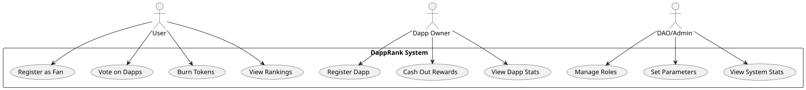
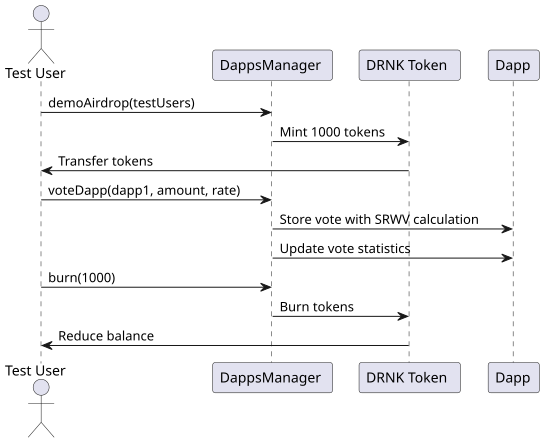

# DappRank

Status: **In Progress** - Core contracts deployed on Sepolia, Uniswap v4 hook implemented and tested, production pool deployment blocked by CREATE2 factory requirement.

[DappRank Website dnsLink](https://dapprank.decentralizedscience.org)

[ipns](https://gateway-mx.decentralizedscience.org/ipns/dapprank.decentralizedscience.org/)

IPFS CID: bafybeidzfwsyugg4yxp46t6ag7ikjz43kh6oqgkxh2h5p2qynzjey4tipu

Dapps contract address: [0x6b0EB389DD4B3ad4E9a28f56f971735aD2A85baD](https://sepolia.etherscan.io/address/0x6b0EB389DD4B3ad4E9a28f56f971735aD2A85baD)

DRNK Token contract address: [0x9549A8CcaB9fF25Cf5061bFBC5188Baed0615B60](https://sepolia.etherscan.io/address/0x9549A8CcaB9fF25Cf5061bFBC5188Baed0615B60)

The DappRank DeFi model introduces a revolutionary decentralized ranking system
for dapps using a novel voting mechanism called Square Root Weighted Voting
(SRWV). This system addresses the critical issue of whale manipulation in
decentralized governance while establishing the foundation for an
"ultrasound money model" that aims to decrease token supply over time,
similar to how Ethereum's supply decreases through the "ultrasound money"
concept.



Img 1. Shows Use Case of DappRank

The SRWV model provides a mathematically sound solution for decentralized
governance while aligning with the ultrasound money model's deflationary goals.
By implementing the square root function for voting power calculation, DappRank
achieves:

- Fairer distribution of governance influence
- Protection against whale manipulation
- Sustainable tokenomics through supply reduction mechanisms [2][3]

## Square Root Weighted Voting (SRWV) Mathematical Formalization

The SRWV system in DappRank implements a mathematically rigorous approach to
decentralized governance. The core mechanism is defined by the following
equations:

### Voting Power Calculation

$$
W_i = \sqrt{T_i}
$$

Where:

- $W_i$: Fan weight (voting power) of voter $i$
- $T_i$: Tokens staked by voter $i$ [2]

This equation ensures voting power grows sublinearly with token holdings, reducing the influence of large stakeholders [2].

### Final Dapp Rating Calculation

$$
D_r = \frac{S_{vw}}{S_{wt}} = \frac{\sum_{i} (V_i \times \sqrt{T_i})}{\sum_{i} \sqrt{T_i}}
$$

Where:

- $D_r$: Final rating of dApp $D$
- $V_i$: Vote rate assigned by voter $i$ (0 < $V_i$ ≤ 100)
- $S_{vw}$: Sum of weighted votes $\sum_{i} (V_i \times \sqrt{T_i})$
- $S_{wt}$: Sum of total weights $\sum_{i} \sqrt{T_i}$ [2]

### Implementation Context

1. **Fan Weight Execution**: The `voteDapp` function in `DappsManager.sol` calculates fan weight using `Math.sqrt(_amount, Math.Rounding.Ceil)` to approximate $ \sqrt{T_i} $ [2]
2. **Weighted Vote Aggregation**: The contract maintains running totals:
   - `dapp.weight_votes_sum += (vote.vote_rate * vote.fan_weight)`
   - `dapp.weight_total_sum += vote.fan_weight` [2]
3. **Rating Finalization**: The final dApp rating is computed as `dapp.rate = dapp.weight_votes_sum / dapp.weight_total_sum` [2]

## Test Validation [3]

The test suite in `DappsManager.t.sol` provides empirical validation:

- For 5 test users with dynamic voting amounts, the system correctly calculates:
  - `weight_votes_sum = 6,380,084,467,978`
  - `weight_total_sum = 106,138,700,962`
  - Final rating `rate = 60` (calculated as $ 6,380,084,467,978 / 106,138,700,962 $) [2]

## Ultrasound Money Model Integration

The SRWV mechanism directly supports the ultrasound money model through:

1. **Deflationary Burning**: A portion of voting tokens is burned during reward distribution [2]
2. **Supply Control**: Token reduction via:
   - Listing fees burned during dApp registration
   - Voting rewards partially burned [2]
3. **Dynamic Equilibrium**: The square root function ensures token utility remains balanced between governance power and scarcity [2]

## Uniswap v4 Ultrasound Hook (In Progress)

A Uniswap v4 hook (`DrnkUltrasoundHook`) has been implemented that burns a configurable percentage of DRNK on each LP swap, creating deflationary pressure on the liquidity pool route.

### Current Status

| Phase | Status | Blocker |
|-------|--------|---------|
| Hook implementation | Complete | - |
| Unit tests | Complete | - |
| Fuzz/Invariant tests | Complete | - |
| Pool integration tests | Complete | - |
| CREATE2 deployment | Blocked | v4-core PoolManager requires solc 0.8.26 exactly; project uses 0.8.36 |
| Production pool funding | Blocked | Requires CREATE2 factory + compiler resolution |

### Key Hook Features

- Burns configurable % of DRNK output on swaps (default 2%, range 0.5%-100%)
- Admin controls: pause, burn fee adjustment, ownership transfer
- Pool verification: checks pool manager, DRNK currency, owner
- Events: `DrnkBurned`, `BurnFeeUpdated`, `HookPaused`, `HookUnpaused`, `OwnershipTransferred`

### Liquidity Pool Strategy

- Initial LP target: 0.3 ETH + ~315.79 DRNK
- Target price: 5% discount vs `buyDRNK()` route
- `buyDRNK()` reference price: 0.001 ETH/DRNK
- LP target price: 0.00095 ETH/DRNK

### Test Results

- 52/52 local tests pass (unit, fuzz, invariant, pool integration)
- Fork tests require `--fork-url` flag
- Full pool initialization works on Anvil with mined CREATE2 salt

### Remaining Work

1. Deploy CREATE2 factory on Sepolia
2. Mine salt for hook with correct permission bits
3. Deploy hook via CREATE2
4. Initialize pool and seed liquidity
5. Monitor and tune parameters
6. Final documentation

Full plan: [`docs/UNISWAP_ULTRASOUND_HOOK_PLAN.md`](./docs/UNISWAP_ULTRASOUND_HOOK_PLAN.md)
Tokenomics research: [`docs/UNISWAP_ULTRASOUND_TOKENOMICS.md`](./docs/UNISWAP_ULTRASOUND_TOKENOMICS.md)

## Security and Governance Implications

1. **Whale Resistance**: The mathematical properties of $ \sqrt{T_i} $ create diminishing returns for large token holders:
   - 1,000 tokens = 31.6 votes
   - 10,000 tokens = 100 votes [2]
2. **Equity Preservation**: Small token holders maintain proportional influence relative to large stakeholders
3. **Game-Theoretic Stability**: The system creates natural disincentives for vote manipulation through its mathematical structure [2]

## [WhitePaper](./WP.md)



Img 2. Shows Sequence Diagram of the Voting Process

which also includes a Demo test process to understand the Voting and other procedures.

## Install requirements

- bun
- foundry
- git

> Note: tested on linux

## Install

```shell
$ git clone https://github.com/P1R/DappRank.git
```

```shell
$ cd DappRank
```

install frontend requirements

```shell
$ bun install
```

## Frontend Development & Deployment

run the development mode

```shell
$ bun run dev --open
```

to host the site use either fleek, piñata or nft.storage.

## Foundry Usage

### Build

```shell
$ forge build
```

### Test

```shell
$ forge test
```

## Smart Contracts Deployment testing

use tmux or in an alternative shell run anvil

```shell
$ anvil --host 0.0.0.0
```

source the .env which contains the deployment variables
for further information check the [envexample](./envexample) file

```shell
$ source .env
```

execute the deployment script

```shell
$ forge script script/DappsManager.s.sol:DappsManagerScript  --rpc-url $PROVIDER_URL --private-key $PK0 --broadcast
```

execute the DemoTest script which will add some demo dapps to the blockchain set in the .env
and retrive them also it will mint some tokens for specified accounts for playing with it:

```shell
$ forge script script/DemoTest.s.sol:DemoTestScript  --rpc-url $PROVIDER_URL --private-key $PK0 --broadcast
```

## References

1. [DRNK](./src-sc/DRNK.sol)
2. [DappsManager](./src-sc/DappsManager.sol)
3. [Demo test](./test/DappsManager.t.sol)
4. https://ethereum.stackexchange.com/questions/87451/solidity-error-struct-containing-a-nested-mapping-cannot-be-constructed
