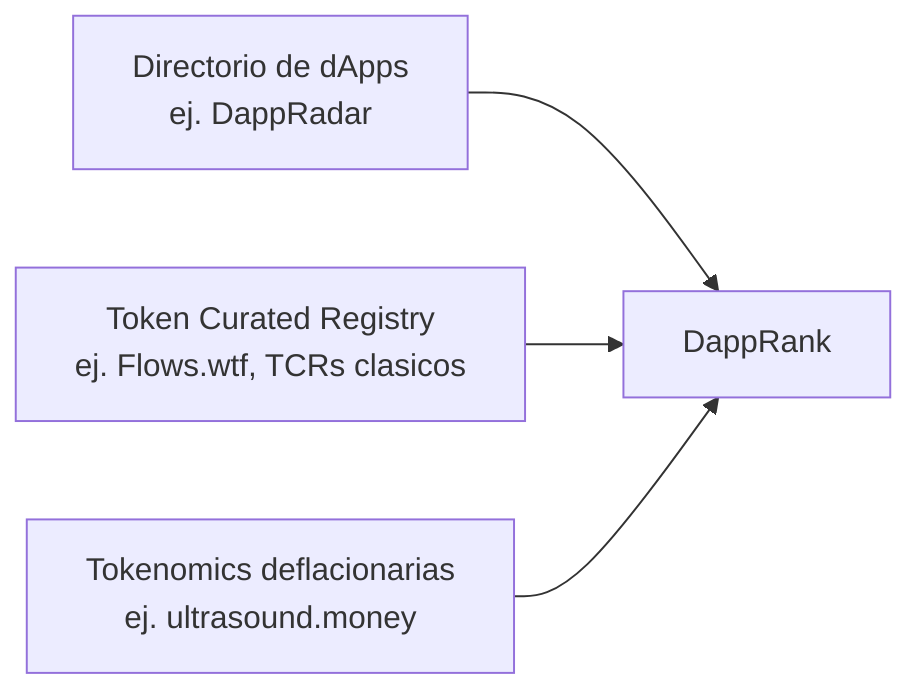

# Análisis Comparativo: DappRank vs. Proyectos Similares

> ## 📦 HISTÓRICO (2026-09-06)
>
> **Investigación conservada como evidencia del proceso de diseño.** Guió la
> UI/UX implementada en `src/`. **No actuar sobre este documento** — la UI ya
> está implementada y validada.

> Reporte de investigación para guiar el diseño de una UI más amigable y entendible.
> Compara **DappRank** (ranking de dApps con Square Root Weighted Voting + tokenomics deflacionarias) contra proyectos existentes en tres categorías: directorios de dApps, sistemas de votación/curación con tokens, y modelos de tokenomics deflacionarias.

---

## 1. Resumen ejecutivo

DappRank es un híbrido de tres modelos que normalmente existen por separado:

Ningún proyecto analizado combina las tres cosas a la vez. Esa combinación es la **ventaja diferencial** de DappRank, pero también su mayor **riesgo de UX**: el usuario debe entender tres conceptos nuevos (ranking, voto ponderado por raíz cuadrada, quema de tokens) en una sola interfaz.

---

## 2. Categoría 1 — Directorios / Rankings de dApps

| Proyecto                                                              | Similitudes con DappRank                                                       | Diferencias con DappRank                                                                                                                                          |
| --------------------------------------------------------------------- | ------------------------------------------------------------------------------ | ----------------------------------------------------------------------------------------------------------------------------------------------------------------- |
| **[DappRadar](https://dappradar.com/rankings)**                       | Lista/ordena dApps; muestra un score o métrica por dApp; filtros por categoría | Ranking basado en **métricas on-chain automáticas** (usuarios, volumen, TVL), no en votos de la comunidad; sin token de gobernanza propio; centralizado (empresa) |
| **[State of the DApps](https://www.stateofthedapps.com/)**            | Directorio curado, cards por dApp con descripción y categoría                  | Curación editorial/manual, no algorítmica; sin staking ni incentivos económicos para votar                                                                        |
| **[DeFiLlama](https://defillama.com/)**                               | Presenta un "rating" agregado por proyecto (Universal Token Ratings, AAA→CCC)  | El rating combina _disclosure_ (transparencia auto-reportada) × _performance_ de mercado, no votos ponderados por staking de la comunidad                         |
| **[CoinGecko Trust Score](https://www.coingecko.com/en/methodology)** | Traduce una fórmula compleja en un score simple (0-100) para el usuario final  | El score lo calcula CoinGecko internamente con datos de mercado/liquidez, no la comunidad vía votación on-chain                                                   |

**Conclusión de categoría:** estos proyectos resuelven bien el problema de "mostrar muchos datos de forma legible", pero **ninguno usa votación económica de la comunidad** como fuente del ranking. Ahí DappRank es único, pero también carece de un patrón de UI ya "resuelto" que copiar 1:1 — hay que adaptar sus tablas/cards a un contexto de votación.

---

## 3. Categoría 2 — Votación / Curación con staking de tokens

| Proyecto                                                                                   | Similitudes con DappRank                                                                                                                                          | Diferencias con DappRank                                                                                                                                                                                                                          |
| ------------------------------------------------------------------------------------------ | ----------------------------------------------------------------------------------------------------------------------------------------------------------------- | ------------------------------------------------------------------------------------------------------------------------------------------------------------------------------------------------------------------------------------------------- |
| **Token Curated Registries clásicos** (adChain, Kleros T2CR, district0x)                   | Modelo _stake → vota/challenge → recompensa o slashing_; el token determina quién puede curar                                                                     | Usan un esquema **binario** (dentro/fuera de la lista) vía challenge period, no un **rating continuo 0-100** como el `D_r` de DappRank; voto lineal por token, sin función raíz cuadrada                                                          |
| **[Flows.wtf](https://flows.wtf)**                                                         | TCR activo y moderno: comprar el token da derecho a curar; recompensas a curadores; funding continuo a builders                                                   | Su objetivo es **financiar builders** (fondos fluyendo), no producir un ranking de calidad/reputación de dApps; no usa peso `√tokens`                                                                                                             |
| **[Gitcoin Grants / Grants Stack](https://grants.gitcoin.co/)** (Quadratic Funding/Voting) | Usa raíz cuadrada matemáticamente para des-incentivar ballenas (mismo principio que SRWV); UI de "explorar proyectos → asignar tu poder → ver resultado agregado" | La raíz cuadrada se aplica a **contribuciones monetarias** para calcular matching de fondos, no a tokens en staking para calcular un rating; requiere verificación de identidad (Gitcoin Passport) para evitar sybil, DappRank no                 |
| **[Snapshot](https://snapshot.org/)**                                                      | Votación con estrategias de peso (incluye variantes sqrt/quadráticas); UI de "propuesta → votar → barra de resultados"                                            | Es una herramienta de **gobernanza genérica** (sí/no/multiple choice sobre propuestas), no un sistema de rating continuo de un catálogo de dApps; normalmente off-chain (gasless) con snapshot de balances, DappRank es on-chain con staking real |

**Conclusión de categoría:** el mecanismo matemático de DappRank (SRWV) **ya tiene precedente validado** en Quadratic Funding/Voting — es la misma idea de "raíz cuadrada reduce el poder de las ballenas", aplicada a un contexto distinto (rating de dApps en vez de reparto de fondos). Esto es bueno: puedes reusar patrones de UI de Gitcoin/Snapshot (barras de poder de voto, visualización de "tu voto vs. total") sin inventar desde cero.

---

## 4. Categoría 3 — Tokenomics deflacionarias

| Proyecto                                          | Similitudes con DappRank                                                                                        | Diferencias con DappRank                                                                                                                                                                                                                          |
| ------------------------------------------------- | --------------------------------------------------------------------------------------------------------------- | ------------------------------------------------------------------------------------------------------------------------------------------------------------------------------------------------------------------------------------------------- |
| **[ultrasound.money](https://ultrasound.money/)** | Narrativa central de "quema reduce el suministro con el tiempo"; dashboard con contador de quema en tiempo real | Quema ligada a **fees de transacción de toda la red Ethereum** (EIP-1559), es pasiva y automática; DappRank quema por **acciones específicas** (listado de dApps, distribución de recompensas), es un mecanismo de producto, no de protocolo base |
| **DefiLlama Universal Token Ratings**             | Da un "grado" entendible (AAA-CCC) derivado de una fórmula compuesta, igual que el `D_r` de DappRank            | No incorpora quema de tokens como parte del rating; es puramente informativo, no gobernanza                                                                                                                                                       |

**Conclusión de categoría:** DappRank puede tomar prestado el **estilo visual** de ultrasound.money (contador animado, gráfico de oferta neta) para visualizar la quema del token DRNK, aunque el mecanismo subyacente sea distinto (quema por producto vs. quema por protocolo).

---

## 5. Tabla comparativa global

| Dimensión                     | DappRank                        | DappRadar                     | TCR clásico (adChain)           | Flows.wtf               | Gitcoin QF/QV                         | Snapshot                  | ultrasound.money          |
| ----------------------------- | ------------------------------- | ----------------------------- | ------------------------------- | ----------------------- | ------------------------------------- | ------------------------- | ------------------------- |
| **Qué rankea/cura**           | dApps                           | dApps                         | Listados genéricos              | Builders/proyectos      | Grants/proyectos                      | Propuestas de gobernanza  | N/A (solo métricas ETH)   |
| **Fuente del score**          | Voto ponderado √tokens          | Métricas on-chain automáticas | Voto binario por stake          | Voto continuo por stake | Donación ponderada √monto             | Voto ponderado (variable) | Quema automática por fees |
| **Rating final**              | Continuo 0-100                  | Ranking por métrica cruda     | Binario (in/out)                | Continuo (streaming)    | Matching de fondos                    | Resultado por propuesta   | N/A                       |
| **Anti-ballena**              | Sí (√T)                         | No aplica                     | No (lineal)                     | Parcial                 | Sí (√contribución)                    | Depende de estrategia     | No aplica                 |
| **Tokenomics deflacionarias** | Sí (quema en listado + rewards) | No                            | Algunos (slashing)              | No                      | No                                    | No                        | Sí (core del proyecto)    |
| **Verificación de identidad** | No                              | No                            | No                              | No                      | Sí (Passport)                         | Opcional                  | No aplica                 |
| **Descentralización**         | Alta (on-chain, smart contract) | Baja (empresa centralizada)   | Alta                            | Alta                    | Media (infra centralizada + on-chain) | Media (votos off-chain)   | Alta (protocolo)          |
| **Madurez de UI/UX**          | Temprana (proyecto nuevo)       | Muy alta                      | Baja (proyectos discontinuados) | Alta                    | Muy alta                              | Alta                      | Alta                      |

---

## 6. Qué es único de DappRank (sin equivalente directo)

1. **Rating continuo generado por voto económico ponderado por raíz cuadrada** — combina lo mejor de TCR (stake real, on-chain) con lo mejor de Quadratic Voting (protección anti-ballena), pero para producir un **score de reputación**, no un in/out ni un reparto de fondos.
2. **Tokenomics deflacionarias integradas al flujo de curación** — la quema ocurre por _listar_ y por _cobrar recompensas_, no solo por actividad de red.
3. **Ranking abierto de dApps gobernado 100% por la comunidad vía staking**, sin curación editorial ni empresa centralizada de por medio (a diferencia de DappRadar/State of the DApps).

## 7. Qué patrones de UI conviene adoptar (por proyecto de referencia)

| Elemento de UI a construir                                     | Inspirarse en                                            |
| -------------------------------------------------------------- | -------------------------------------------------------- |
| Tabla/grid principal de ranking                                | DappRadar, DeFiLlama                                     |
| Visualización simple del rating (sin mostrar la fórmula cruda) | CoinGecko Trust Score, DeFiLlama Universal Token Ratings |
| Barra "tu poder de voto vs. poder total"                       | Snapshot, Gitcoin Quadratic Voting                       |
| Estado de una dApp (pendiente / en votación / rankeada)        | TCR clásicos (adChain, Kleros T2CR)                      |
| Contador de quema de tokens en tiempo real                     | ultrasound.money                                         |
| Card de proyecto con progreso/soporte comunitario              | Gitcoin Grants Stack, Flows.wtf                          |

---

## 8. Riesgo principal a mitigar en la UI

Ningún competidor combina **rating + voto ponderado + quema** al mismo tiempo, por lo que no existe un layout "copiable" completo. El objetivo de diseño debe ser **ocultar la complejidad matemática** (√T, sumatorias) detrás de visualizaciones simples ya validadas por estos proyectos (barras, contadores, badges de estado), en vez de exponer las fórmulas del whitepaper directamente en la interfaz de usuario.

---

## 9. Qué se puede aplicar HOY sin desarrollar features nuevas

Se revisó el código actual (`src/components/*.svelte`, `src/lib/ethers.svelte.js`) para separar las sugerencias de la sección 7 en dos grupos: las que solo requieren **cambios visuales/de presentación** sobre datos que **ya se obtienen del contrato**, y las que necesitan una llamada nueva, completar una feature a medias, o datos que hoy no existen.

### ✅ Aplicables ahora (solo UI, sobre datos ya disponibles)

| #   | Sugerencia                                                                                          | Por qué ya se puede                                                                                                                                                                                                                                                               | Dónde tocar                                                                |
| --- | --------------------------------------------------------------------------------------------------- | --------------------------------------------------------------------------------------------------------------------------------------------------------------------------------------------------------------------------------------------------------------------------------- | -------------------------------------------------------------------------- |
| 1   | **Badge de estado con color** (pendiente / en votación / rankeada) en vez de texto plano            | `info.status` ya llega desde `getDappInfo()` (`DappsData.svelte`) y ya se renderiza como `Status: {item.status}` (`DappRankList.svelte`). Solo falta mapear el valor a un color/ícono con CSS.                                                                                    | `DappRankList.svelte`                                                      |
| 2   | **Colorear el número/barra de rating** (rojo/ámbar/verde según rango), estilo CoinGecko Trust Score | `item.rating` (0-100) ya está calculado y ya se dibuja como barra de progreso. Es una función pura `rating → color`, sin tocar datos.                                                                                                                                             | `DappRankList.svelte`                                                      |
| 3   | **Barra "consenso de la comunidad"** (`weight_votes_sum` vs `weight_total_sum`)                     | Ambos campos **ya se obtienen** del contrato en `getDappInfoForName()` (`DappsData.svelte`) y se guardan en `ethVars.dappsList`, pero hoy **no se pasan** al `data` derivado de `DappRankList.svelte`. Solo hay que agregarlos al `.map()` existente y dibujar una segunda barra. | `DappRankList.svelte`                                                      |
| 4   | **Contador total de tokens quemados** (estilo ultrasound.money)                                     | `tokensBurned` ya existe por cada dApp. El total es una simple sumatoria (`reduce`) sobre `ethVars.dappsList`, que ya está poblado. No requiere ninguna llamada nueva al contrato.                                                                                                | Nuevo bloque pequeño en `App.svelte` o encabezado de `DappRankList.svelte` |
| 5   | **Preview de "tu poder de voto" al escribir el monto** (`√amount`) en el modal de votar             | El campo `amount` del formulario ya existe (`Vote4Dapp.svelte`). Mostrar `Math.sqrt(amount)` junto al input es cálculo puro en el cliente, igual a la fórmula del whitepaper — no llama al contrato.                                                                              | `Vote4Dapp.svelte`                                                         |
| 6   | **Selector de dApp en vez de campo de texto libre** para votar                                      | `ethVars.dappsList` ya contiene todos los nombres de dApps (poblados por `DappsData.svelte`). Cambiar el `<input type="text">` de `dappName` por un `<select>` que itere esa lista ya cargada reduce errores de tipeo, sin nueva llamada ni contrato.                             | `Vote4Dapp.svelte`                                                         |
| 7   | **Reordenar visualmente las tarjetas por rating** (mayor a menor)                                   | El array `data` ya tiene `rating` calculado para cada dApp; ordenar antes de `{#each}` es una sola línea (`.sort()`), sin nuevas fuentes de datos. _(Nota: hay un comentario `// ToDo Must order them` en el código — ver advertencia abajo.)_                                    | `DappRankList.svelte`                                                      |

### ❌ Requieren completar algo pendiente o desarrollar una feature nueva (fuera de este alcance)

| #   | Sugerencia                                                                                | Por qué NO aplica todavía                                                                                                                                                                                                                                               |
| --- | ----------------------------------------------------------------------------------------- | ----------------------------------------------------------------------------------------------------------------------------------------------------------------------------------------------------------------------------------------------------------------------- |
| A   | **Mostrar el balance real de tokens DRNK del usuario**                                    | `tokenBalance` está _hardcodeado en 0_ en `Vote4Dapp.svelte` y `GetDRNK.svelte`, con la llamada `balanceOf()` comentada explícitamente ("In a real implementation, you'd fetch the actual balance"). Es una feature incompleta, no solo UI.                             |
| B   | **Botón "Add Dapp"**                                                                      | Existe en `App.svelte` pero sin `onclick` ni lógica asociada — es un placeholder, requiere desarrollo nuevo (probablemente un formulario + llamada a un método de registro en el contrato).                                                                             |
| C   | **"Tu poder de voto individual ya emitido" por dApp**                                     | El contrato expone `weight_votes_sum`/`weight_total_sum` **agregados de todos los votantes**, no el voto individual del usuario conectado. Mostrar "tu" aporte real requeriría una nueva consulta (mapping por dirección) que hoy no está expuesta por `getDappInfo()`. |
| D   | **Ordenamiento por rating persistido/con controles de UI** (asc/desc, por otras columnas) | El propio código ya marca esto como `// ToDo` sin implementar; aunque la ordenación básica es trivial (ver punto 7 arriba), una UI completa de sorting/filtros multi-columna sí es una feature nueva.                                                                   |
| E   | **Tags/categorías reales de cada dApp** (actualmente `['DApp', 'Web3']` fijo para todas)  | El array `tags` está hardcodeado igual para todas las dApps en `DappRankList.svelte`; no viene del contrato ni de metadata real. Mostrar categorías reales requeriría agregar ese campo al contrato/IPFS y a `getDappInfo()`.                                           |

### Resumen

De las 6 sugerencias de la sección 7, **la mayoría de sus variantes básicas ya son viables con los datos que el contrato ya expone y que el frontend ya consulta** — el trabajo pendiente es de presentación (colores, barras, cálculos derivados en el cliente), no de integración blockchain. Las excepciones (balance real del usuario, botón "Add Dapp", voto individual por dApp, tags reales) dependen de piezas que el propio código deja marcadas como incompletas o inexistentes.
