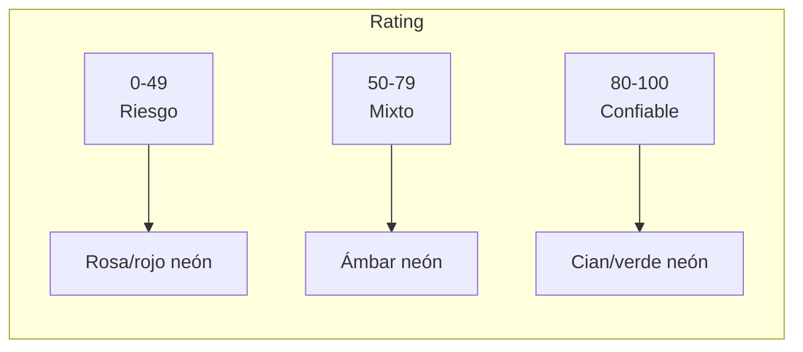

# Plan de Mejoras UI/UX — DappRank

> ## 📦 HISTÓRICO (2026-09-06)
>
> **Plan conservado como evidencia del proceso de diseño.** El plan fue
> ejecutado (UI/UX mobile-first + accesibilidad implementada en `src/`).
> **No actuar sobre este documento** — ver `AI_USAGE.md` para el registro de
> lo implementado.

> Traduce los patrones identificados en `COMPARATIVE_ANALYSIS.md` (secciones 7 y 9) en cambios concretos, priorizados y justificados, **antes** de tocar código. Mantiene la identidad visual neon/cyberpunk ya existente — el objetivo es darle _significado_ a esa estética, no reemplazarla.

---

## 1. Principios de diseño a adoptar

Extraídos de los proyectos de referencia, adaptados a lo que ya existe en DappRank:

| Principio                                                           | De dónde viene                        | Por qué aplica aquí                                                                                                                                                                 |
| ------------------------------------------------------------------- | ------------------------------------- | ----------------------------------------------------------------------------------------------------------------------------------------------------------------------------------- |
| **El rating es el protagonista visual**                             | CoinGecko Trust Score, DeFiLlama UTR  | Hoy el rating, tokens donados y tokens quemados se muestran con el mismo peso visual (3 cajas iguales). El rating es la métrica que resume todo lo demás y debería dominar la card. |
| **Traducir números en semántica de color**, no solo en texto        | CoinGecko, DeFiLlama (grados AAA→CCC) | El sistema neon ya tiene cian/magenta/rosa disponibles — se pueden mapear a "confiable / mixto / riesgo" sin salir del tema visual.                                                 |
| **Mostrar la _fuerza_ del consenso, no solo el resultado**          | Snapshot, Gitcoin Quadratic Voting    | Un rating de 90 con 2 votantes no es igual de confiable que uno con 200. Hoy esa información (`weight_votes_sum`/`weight_total_sum`) se obtiene del contrato pero no se muestra.    |
| **Estado del ciclo de vida visible** (pendiente/activo/consolidado) | TCRs clásicos (adChain, Kleros)       | El campo `status` ya existe y se imprime como texto plano; un TCR clásico lo trata como el dato más importante del listado.                                                         |
| **Cerrar el loop de acción cerca del dato**                         | Gitcoin Grants Stack, Flows.wtf       | Votar hoy requiere abrir un modal genérico y **escribir el nombre de la dApp a mano**. En Gitcoin/Flows, la acción de "apoyar" siempre parte de la card del proyecto.               |
| **Narrativa de quema visible de forma persistente**                 | ultrasound.money                      | La quema hoy es un número más dentro de cada card; en ultrasound.money es el elemento central del dashboard. Aquí no necesita ser central, pero sí visible globalmente.             |
| **Ocultar la fórmula, mostrar el efecto**                           | Todos los anteriores                  | En ningún proyecto de referencia se le muestra al usuario una raíz cuadrada o una sumatoria. Se muestra el resultado (barra, badge, contador) y como mucho un tooltip corto.        |

---

## 2. Diagnóstico componente por componente

### `DappRankList.svelte` (el corazón del producto)

| Qué hay hoy                                                                                                           | Problema de UX                                                                                                                                              | Patrón a aplicar                                                                                           |
| --------------------------------------------------------------------------------------------------------------------- | ----------------------------------------------------------------------------------------------------------------------------------------------------------- | ---------------------------------------------------------------------------------------------------------- |
| `rank = index + 1` (orden de llegada del array, **no** el rating real)                                                | El usuario ve "#1" en una dApp que puede tener rating 40, mientras otra con 95 aparece como "#5". Rompe la confianza en el ranking desde el primer vistazo. | Ordenar por `rating` antes de asignar el rank — patrón básico de cualquier ranking (DappRadar, DeFiLlama). |
| Rating, tokens donados y tokens quemados en 3 cajas idénticas (mismo tamaño, mismo color cian)                        | Sin jerarquía: el ojo no sabe qué mirar primero.                                                                                                            | Rating grande y centrado + color semántico; tokens donados/quemados como datos secundarios más pequeños.   |
| Barra de progreso única (ancho = rating), siempre en gradiente cian→magenta                                           | El color no comunica si 90 es bueno o si 20 es malo — es puramente decorativo.                                                                              | Gradiente semántico (verde/ámbar/roso) según rango, o al menos el número en color semántico.               |
| `Status: {item.status}` como texto plano dentro de un tag                                                             | El estado del ciclo de vida (pendiente/en votación/rankeada) es información clave en cualquier TCR, aquí pasa desapercibida.                                | Badge con color + ícono, igual de prominente que el rating.                                                |
| `weight_votes_sum` / `weight_total_sum` **ya llegan del contrato** pero no se pasan al `data` derivado ni se muestran | Se pierde la señal de "cuánta comunidad respalda este número", que es justo lo que diferencia a DappRank de un ranking centralizado.                        | Segunda barra pequeña tipo "fuerza del consenso" (Snapshot) bajo el rating.                                |
| No hay acción para votar desde la card                                                                                | El flujo de voto está desacoplado de la lista — hay que memorizar/copiar el nombre exacto de la dApp.                                                       | Botón "Vote" contextual en cada card (ver Fase 2).                                                         |

### `Vote4Dapp.svelte` (modal de voto)

| Qué hay hoy                                             | Problema de UX                                                                                                                                       | Patrón a aplicar                                                                                                                                                                                                                                                                        |
| ------------------------------------------------------- | ---------------------------------------------------------------------------------------------------------------------------------------------------- | --------------------------------------------------------------------------------------------------------------------------------------------------------------------------------------------------------------------------------------------------------------------------------------- |
| Campo de texto libre para `dappName`                    | Propenso a error de tipeo; el nombre debe coincidir exacto con `bytes32` on-chain. La lista de nombres válidos **ya existe** en `ethVars.dappsList`. | Reemplazar por `<select>` con las dApps ya cargadas.                                                                                                                                                                                                                                    |
| Slider de `rate` (1-100) sin ningún contexto de impacto | El usuario no sabe qué pasa con su voto: ¿cambia mucho o poco el rating final?                                                                       | Simulación en vivo: con `weight_votes_sum`/`weight_total_sum` de la dApp seleccionada + `√amount` del monto ingresado, se puede **previsualizar el nuevo rating resultante** en tiempo real, sin llamar al contrato — es la misma fórmula del whitepaper aplicada del lado del cliente. |
| Campo `amount` sin traducción a "poder de voto"         | La raíz cuadrada es el corazón conceptual de DappRank y hoy es invisible para el usuario.                                                            | Mostrar `√amount` junto al input ("tu poder de voto: X") — refuerza la narrativa anti-ballena de forma simple.                                                                                                                                                                          |
| "Your Balance: {tokenBalance}" siempre en 0             | Ya identificado como feature incompleta (fuera de alcance de este plan).                                                                             | _(No tocar en esta iteración — ver `COMPARATIVE_ANALYSIS.md` §9-A)_                                                                                                                                                                                                                     |

### `GetDRNK.svelte` ("Buy Tokens")

Sin cambios de fondo propuestos en esta iteración — su balance en 0 depende de la misma pieza incompleta que `Vote4Dapp`. Se puede alinear visualmente (mismo estilo de card/botón) una vez se definan los cambios de la lista principal.

### `App.svelte` (header / layout general)

| Qué hay hoy                                                                                   | Problema de UX                                                                                                | Patrón a aplicar                                                                                                                                                                      |
| --------------------------------------------------------------------------------------------- | ------------------------------------------------------------------------------------------------------------- | ------------------------------------------------------------------------------------------------------------------------------------------------------------------------------------- |
| Botones de acción (Vote, Buy, Refresh, Add Dapp, Wallet) en una fila, sin agrupar por función | Mezcla acciones de "explorar" con acciones de "participar" sin jerarquía.                                     | Agrupar visualmente: identidad/wallet a la derecha, acciones de participación (votar/comprar) juntas.                                                                                 |
| Ninguna referencia global a la narrativa de quema/deflación                                   | La propuesta de valor de "ultrasound money model" no se ve en ningún lado de la interfaz salvo el whitepaper. | Añadir un contador pequeño de "Total DRNK Burned" (suma de `tokensBurned` ya calculada en el listado) cerca del header o encima de la lista — sin nueva llamada al contrato.          |
| Botón **"Add Dapp"** sin acción                                                               | Placeholder que rompe la expectativa del usuario al hacer click.                                              | _(Fuera de alcance — requiere feature nueva, ver `COMPARATIVE_ANALYSIS.md` §9-B. Se recomienda ocultarlo o marcarlo "Coming soon" mientras no esté implementado, para no confundir.)_ |

### `IPFSConnector.svelte`

No forma parte del flujo de ranking/voto — queda fuera del alcance de esta pasada de UI/UX (es una utilidad de carga de archivos, no una vista de datos).

---

## 3. Sistema visual propuesto (evolución, no reemplazo)

Se mantiene la paleta neon ya definida (cian `#00f7ff`, magenta/rosa `#ff00ff`), añadiendo **significado semántico** sin introducir colores nuevos ajenos al tema:

- **Rating alto (80-100):** tono cian/verde intenso — ya es el color "positivo" del tema actual.
- **Rating medio (50-79):** ámbar/amarillo neón — color nuevo pero coherente con la estética (glow suave).
- **Rating bajo (0-49):** rosa/magenta ya existente, reinterpretado como "alerta" en este contexto.
- **Badges de estado:** mismo código de color, aplicado al texto de `status`.
- **Jerarquía tipográfica:** el número de rating pasa a ser el elemento más grande de la card (hoy compite en tamaño con rank y nombre).
- **Micro-copy en vez de fórmulas:** por ejemplo, en lugar de mostrar `√T`, un texto corto como _"Tu voto pesa menos mientras más tokens tengas — así protegemos el ranking de ballenas."_

---

## 4. Priorización propuesta

### Fase 1 — Solo estilos y cálculos derivados (sin tocar arquitectura de componentes)

No requiere pasar datos entre componentes ni nuevas llamadas al contrato. Es la más rápida y de menor riesgo:

1. Ordenar las cards por `rating` real antes de asignar `rank`.
2. Color semántico en el número/barra de rating.
3. Badge de `status` con color + ícono.
4. Segunda barra de "fuerza del consenso" usando `weight_votes_sum`/`weight_total_sum` (agregar esos campos al `.map()` de `DappRankList.svelte`).
5. Contador global de "Total DRNK Burned" (suma sobre `ethVars.dappsList`, ya poblado).

### Fase 2 — Pequeños cambios de comunicación entre componentes (sigue sin tocar contratos)

Requiere que `Vote4Dapp` reciba qué dApp se seleccionó desde la lista, y mostrar simulaciones:

6. Botón "Vote" contextual en cada card que abra el modal con `dappName` pre-cargado.
7. `<select>` de dApps (usando `ethVars.dappsList`) en vez de texto libre, como respaldo si se abre el modal sin preselección.
8. Preview de poder de voto (`√amount`) y simulación del nuevo rating estimado, en tiempo real, dentro del modal.

### Fase 3 — Fuera de alcance de este plan (requieren feature nueva o completar algo pendiente)

Ya documentado en `COMPARATIVE_ANALYSIS.md` §9: balance real de DRNK, botón "Add Dapp" funcional, voto individual por dirección, tags/categorías reales. Se recomienda **ocultar o deshabilitar visualmente** el botón "Add Dapp" mientras tanto, para no generar expectativas rotas.

---

## 5. Antes de implementar — puntos a validar contigo

1. **¿Arrancamos por la Fase 1 completa** (5 cambios, solo estilos/derivados) y dejamos Fase 2 para una siguiente iteración, o quieres las dos fases juntas?
2. **Paleta ámbar nueva:** ¿la agrego al `app.css`/tema de Tailwind ya existente, o prefieres reutilizar solo cian/magenta con distinta intensidad para no introducir un color más?
3. **Botón "Add Dapp":** ¿lo oculto, lo deshabilito con tooltip "Coming soon", o lo dejamos igual por ahora?
4. **Simulación de rating en el modal de voto (Fase 2, punto 8):** ¿te parece bien mostrarla, o prefieres mantener el modal más simple y dejar esa explicación para un tooltip informativo en vez de un cálculo en vivo?
