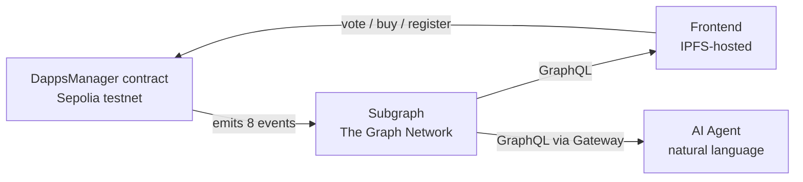

# DappRank — Architecture & Data Flow

How live data flows from the blockchain to the AI agent.



## Components

| Component | Where | Role |
|-----------|-------|------|
| **DappsManager contract** | `0x6b0EB389DD4B3ad4E9a28f56f971735aD2A85baD` (Sepolia) | Source of truth. Emits `DappRegistered`, `DappApproved`, `DappBanned`, `VoteCast`, `TokensBurned`, `DappCashOut`, `DappRemoved`, `DappCIDUpdated` |
| **DRNK token** | `0x9549A8CcaB9fF25Cf5061bFBC5188Baed0615B60` | ERC20 voting token (18 decimals) |
| **Subgraph** | `https://api.studio.thegraph.com/query/1760241/dapprank/v0.0.2` | Indexes the events into `Dapp`, `Vote`, `GlobalStat` |
| **Frontend** | IPFS (fleek/pinata/nft.storage) | Reads ranking from subgraph, falls back to contract reads |
| **AI Agent** | Any MCP client (Claude, Cursor, Zed) | Natural-language queries over the subgraph |

## Event → Entity mapping

| Event | Subgraph handler | Effect |
|-------|------------------|--------|
| `DappRegistered` | `handleDappRegistered` | Creates `Dapp` (status `Submitted`), increments `totalDapps` |
| `DappApproved` | `handleDappApproved` | Sets status `Active` |
| `DappBanned` | `handleDappBanned` | Sets status `Banned` |
| `VoteCast` | `handleVoteCast` | Creates `Vote`, updates `rate`/`weightVotesSum`/`weightTotalSum`/`balance`, increments `totalVotes` |
| `TokensBurned` | `handleTokensBurned` | Updates `burned`, increments `totalBurned` |
| `DappCashOut` | `handleDappCashOut` | Decrements `balance` |
| `DappRemoved` | `handleDappRemoved` | Deletes `Dapp`, decrements `totalDapps` |
| `DappCIDUpdated` | `handleDappCIDUpdated` | Updates `cid` |

## Key invariants (mirrored from the contract)

- `burnFee` = 1000 bp (10%) — burned per vote
- `DAOFee` = 100 bp (1%) — charged at cashout
- `balance` delta per vote = `amount − burn − daoFee`
- The mapping uses `burnFee`/`DAOFee` as constants (no setters in the contract)

## Repo layout

```
src-sc/                    # Solidity contracts
  DappsManager.sol         # Main contract (events + SRWV)
  DRNK.sol                 # ERC20 token
subgraph/                  # The Graph subgraph
  subgraph.yaml            # Manifest (address + startBlock 11692630)
  schema.graphql           # GraphQL schema
  src/mapping.ts           # Event handlers
  abis/DappsManager.json   # Contract ABI (with events)
test/DappsManager.t.sol    # Contract tests (incl. testEventsEmitted)
skills/dapprank-subgraph/  # This skill
```

## Deployment addresses (Sepolia)

| Contract | Address |
|----------|---------|
| DappsManager | `0x6b0EB389DD4B3ad4E9a28f56f971735aD2A85baD` |
| DRNK token | `0x9549A8CcaB9fF25Cf5061bFBC5188Baed0615B60` |
